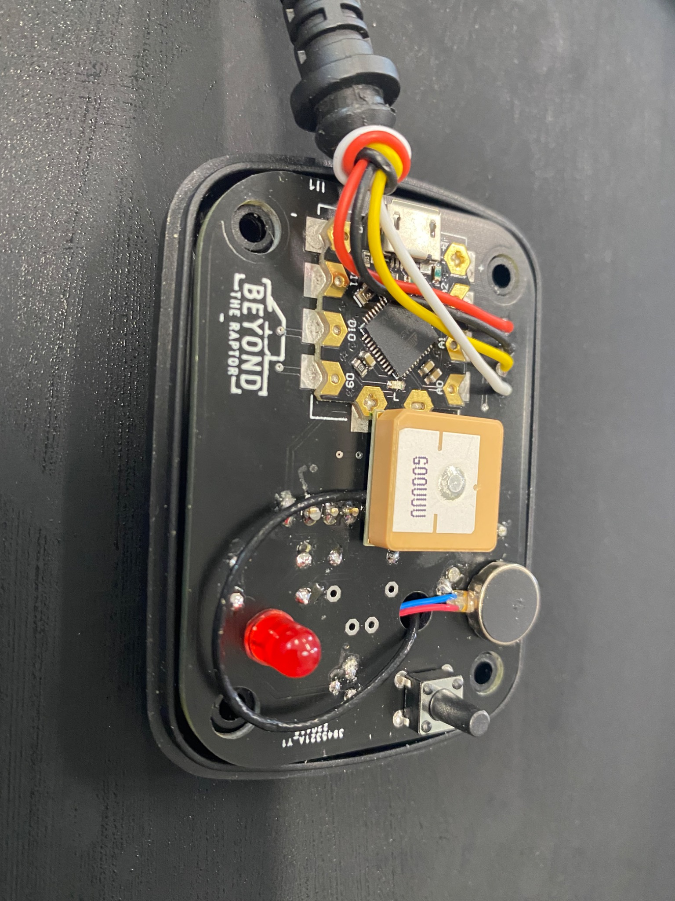
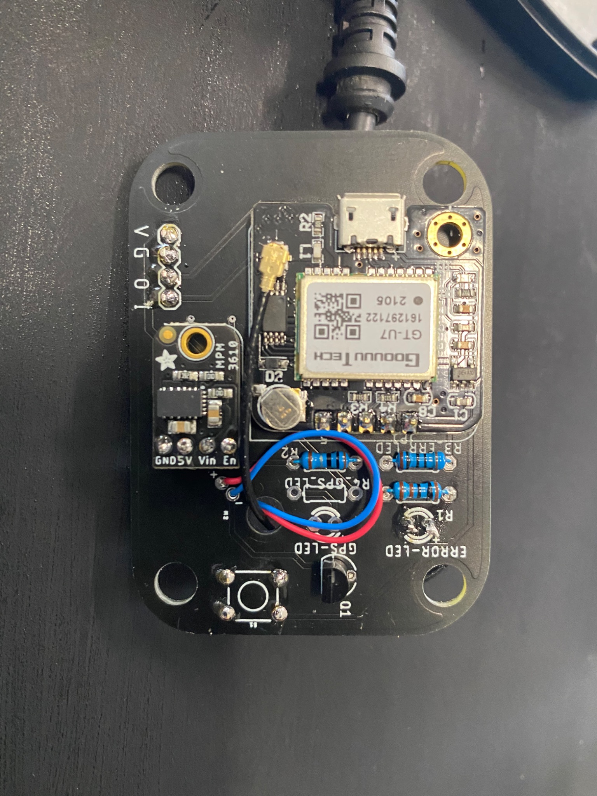
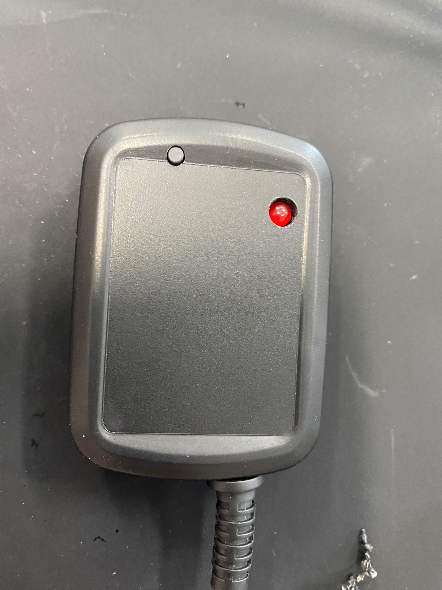
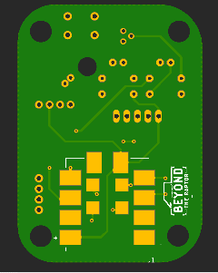

# Smart Light Bar Controller

GPS controller designed for **Aurora Evolve adjustable beam pattern off-road light bars**.

## Assembled GPS controlller

<p align="center">
  
  
  
</p>

## Aurora Evolve light bar

<p align="center">
  
</p>

This project adds a smart GPS-based control layer to the Aurora Evolve system while still letting the user keep the original handheld controller behavior.

**Aurora Evolve product family:**  
https://lexbern.com/collections/aurora-evolve?srsltid=AfmBOorVTvPY1E8R5cCzJ8TLMzEkflyujZKsF8cvEtnp-r9cIhNQSOhc

**Final product demo:**  
https://www.youtube.com/watch?v=3yx3ybBsLAM

---

# Smart Light Bar Controller

Arduino-based smart controller for an off-road LED light bar. The controller sits between an existing manual lighting controller and the light bar, relays normal commands, and can automatically adjust the beam pattern based on GPS speed.

> **Project status:** Prototype / work in progress. GPS-driven light setting changes are implemented in the current sketch. Button behavior, accelerometer behavior, GPS 10 Hz updates, and non-blocking error handling are still being refined.



## What it does

The Smart Light Bar Controller, or **SLC**, listens to the existing lighting controller's 5 V digital signal and retransmits compatible commands to the light bar. When GPS mode is active, the SLC uses vehicle speed to select one of six beam settings:

| Speed range example | Light setting | Beam behavior |
|---:|---:|---|
| 0-9 mph | 1 | Widest pattern |
| 10-19 mph | 2 | Wide |
| 20-29 mph | 3 | Medium-wide |
| 30-39 mph | 4 | Medium-narrow |
| 40-49 mph | 5 | Narrow |
| 50+ mph | 6 | Narrowest / spot pattern |

The default high-speed threshold is **50 mph**. The intent is for the user to be able to set that threshold from the current GPS speed using the onboard button.

## Core features

- Reads GPS speed using TinyGPS++.
- Maps speed into six light-bar settings.
- Sends the light-bar setting command over a 5 V digital output.
- Avoids resending a light setting when the setting has not changed.
- Provides six indicator LEDs for the active speed/light setting.
- Provides a status LED and an error LED.
- Includes early support for an ADXL345 accelerometer and activity/inactivity detection.
- Includes early support for a momentary button and piezo buzzer.
- Includes PCB design files, Gerbers, drill files, and assembly output.

## Hardware

See [`PARTS.md`](PARTS.md) for a cleaner parts list and recommended additions.

### Controller and modules

- Arduino-compatible controller. The requirements document calls for an **Arduino Mega 2560**. The existing parts list also references a compact **DFRobot Beetle**, so confirm which board you want as the official target before publishing.
- GPS module compatible with **NEO-6M** / **GT-U7** style serial GPS modules.
- ADXL345-compatible accelerometer.
- Piezo buzzer, such as TBM12A05-compatible.
- Momentary push button.
- Six light-setting indicator LEDs.
- One accelerometer/status LED.
- One error LED.
- 5 V digital signal interface to the existing lighting controller and light bar.

### Current Arduino pin map

| Function | Pin | Notes |
|---|---:|---|
| Button input | 2 | Uses `ezButton` debounce handling. |
| Light command transmit | 3 | Sends light-bar command timing pulses. |
| Buzzer | 4 | Uses `tone()`. Current beep functions use blocking delays. |
| GPS RX/TX constants | 19 / 18 | Defined in code, but the current sketch uses `Serial2`. Verify the final wiring. |
| Light setting LED 1 | 41 | Setting 1 / wide. |
| Light setting LED 2 | 42 | Setting 2. |
| Light setting LED 3 | 43 | Setting 3. |
| Light setting LED 4 | 44 | Setting 4. |
| Light setting LED 5 | 45 | Setting 5. |
| Light setting LED 6 | 46 | Setting 6 / spot. |
| Additional output | 47 | Configured as output; document final purpose. |
| Blue status LED | 48 | Used for GPS speed update/status in current sketch. Intended for accelerometer state. |
| Error LED | 49 | Used for GPS/error status. |

## Software dependencies

Install these libraries in the Arduino IDE Library Manager or through your preferred Arduino workflow:

- `TinyGPS++`
- `SparkFun ADXL345 Arduino Library`
- `ezButton`

## Getting started

1. Clone the repository.
2. Open `Smart_Light_Bar_Controller.ino` in the Arduino IDE.
3. Install the required libraries listed above.
4. Select the correct board. The current requirements target **Arduino Mega 2560**.
5. Confirm the GPS serial port and baud rate:
   - Default baud rate: `9600`
   - Current sketch uses `Serial2.begin(GPSBaud)`
6. Confirm all pins match your wiring.
7. Upload the sketch.
8. Open Serial Monitor at `9600` baud for debug output.

## Configuration points

The main tuning values are currently near the top of `Smart_Light_Bar_Controller.ino`:

```cpp
static const uint32_t GPSBaud = 9600;
int spotSpeed = 50;           // MPH for full spot setting
int lightSettingsSpeeds[5];   // Calculated speed thresholds
const int buzzerPin = 4;
static const int lightTXPin = 3;
```

The threshold table is recalculated by dividing `spotSpeed` into five threshold breakpoints. For example, `spotSpeed = 50` creates thresholds at 10, 20, 30, 40, and 50 mph.

## Current behavior

### GPS speed mode

When GPS speed is valid, the controller:

1. Reads the current GPS speed in mph.
2. Clears the error LED.
3. Selects the matching light setting from 1-6.
4. Turns on the matching setting LED.
5. Sends the timing pulse sequence for the selected light setting.

### Light command output

`sendLightSetting(int lightIndex)` sends the command timing pattern on `lightTXPin`. It uses the same leading pulse structure for all settings and then repeats short pulses based on the selected setting.

The function skips transmission when the requested setting is already active.

### Error behavior

The current sketch turns the error LED on while waiting for a valid GPS speed. It also halts in a `while(true)` loop if no GPS characters are processed after five seconds.

This should be changed before field use. See [`TODO.md`](TODO.md) for the recommended non-blocking error handling work.

## Planned improvements

The highest-value improvements before calling this GitHub-ready are:

- Configure the GPS module for **10 Hz updates**, or add interpolation between GPS updates.
- Replace all blocking `delay()` and `while(true)` behavior with non-blocking `millis()` state machines.
- Implement the 3-second and 10-second button hold behavior.
- Store the user-selected high-speed threshold in EEPROM.
- Finish ADXL345 interrupt handling and make inactivity/activity callbacks easy to customize.
- Flash the red error LED at 500 ms intervals when GPS speed is unavailable.
- Turn off speed-setting LEDs when not in GPS mode.
- Add bench-test instructions and a simple wiring diagram.

## Repository structure

```text
Smart_Light_Bar_Controller/
├── Smart_Light_Bar_Controller.ino      # Main Arduino sketch
├── README.md                           # Project overview and setup
├── PARTS.md                            # Cleaned-up BOM / parts list
├── TODO.md                             # Implementation checklist
├── GITHUB_PROJECT_RECOMMENDATIONS.md   # Publishing recommendations
├── thumb_image.png                     # Prototype image
└── PCB DESIGN/
    ├── *.pcbdoc / *.dxf                # PCB design exports
    └── Gerber out/
        ├── GerberFiles/                # PCB manufacturing files
        ├── DrillFiles/                 # Drill files
        └── Assembly/                   # Assembly output
```

## Safety notes

This is a vehicle electrical project. Use proper fusing, strain relief, wire gauge, waterproofing, and electrical protection before installing it in a vehicle. Do not rely on breadboard wiring for vehicle use. Validate that the controller cannot accidentally turn lights on, change modes unexpectedly, or interfere with required lighting.

## License

No license has been selected yet. Before publishing publicly, add a license file such as MIT, Apache-2.0, GPL-3.0, or a private/proprietary notice depending on how you want others to use the project.
