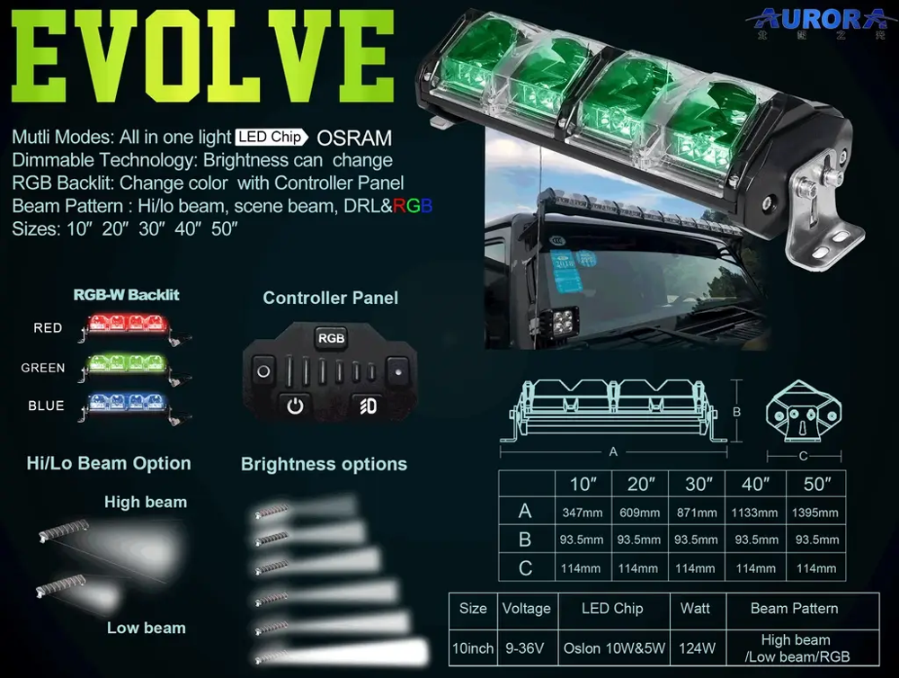
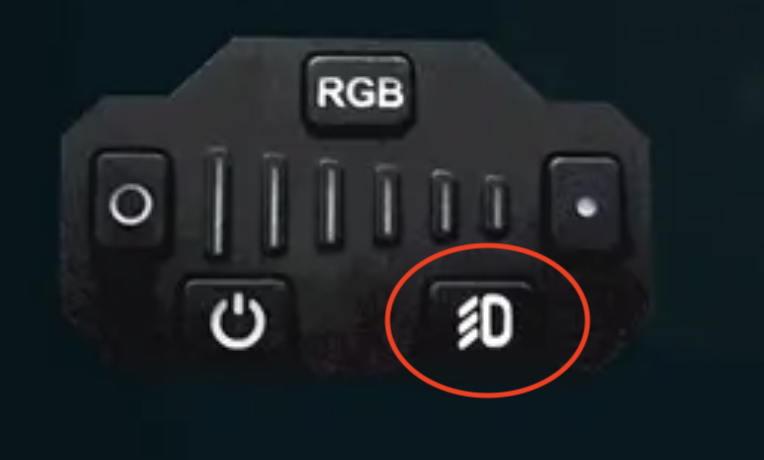

# Smart Light Bar Controller

GPS controller designed for **Aurora Evolve adjustable beam pattern off-road light bars**.

<p align="center">
  
</p>

This project adds a smart GPS-based control layer to the Aurora Evolve system while still letting the user keep the original handheld controller behavior.

**Aurora Evolve product family:**  
https://lexbern.com/collections/aurora-evolve?srsltid=AfmBOorVTvPY1E8R5cCzJ8TLMzEkflyujZKsF8cvEtnp-r9cIhNQSOhc

**Final product demo:**  
https://www.youtube.com/watch?v=3yx3ybBsLAM

---

## Table of contents

- [What it is](#what-it-is)
- [GPS mode activation button](#gps-mode-activation-button)
- [How it works](#how-it-works)
- [Features](#features)
- [Project status](#project-status)
- [Compatibility](#compatibility)
- [What is in this repo](#what-is-in-this-repo)
- [Wiring and signal flow](#wiring-and-signal-flow)
- [Parts](#parts)
- [Compatibility disclaimer](#compatibility-disclaimer)
- [Repository structure](#repository-structure)
- [Recommended next steps](#recommended-next-steps)
- [License](#license)

---

## What it is

The **Smart Light Bar Controller (SLC)** is an Arduino-based inline controller that sits between:

1. the **Aurora Evolve handheld controller**, and
2. the **Aurora Evolve light bar**

The controller monitors the one-wire command signal coming from the Aurora Evolve controller and can either:

- **pass commands through normally** for manual use, or
- **switch into GPS mode** and automatically change the beam setting based on vehicle speed.

At the core, this project is an **Arduino sketch** that reads GPS speed and sends the correct control signals to the light bar.

---

## GPS mode activation button

<p align="center">
  
</p>

The highlighted **high beam button** on the Aurora Evolve controller is used by this project to **activate or deactivate GPS mode**.

### Button behavior

| Controller action | Smart Light Bar Controller behavior |
|---|---|
| Use the Aurora Evolve controller normally | Manual commands pass through to the light bar |
| Press the highlighted high beam button | GPS mode toggles ON or OFF |
| GPS mode ON | The SLC automatically changes beam pattern based on GPS speed |
| GPS mode OFF | Control returns to normal manual controller behavior |

This is the main user interaction: **press the high beam button to turn GPS control on or off**.

---

## How it works

### Manual mode

In normal operation, the user can still use the **Aurora Evolve controller manually**.

The SLC listens to the controller signal and relays compatible commands to the light bar.

### GPS mode

When GPS mode is enabled, the SLC uses GPS speed to automatically select the beam pattern.

Typical behavior:

| Speed range example | Light setting | Beam behavior |
|---:|---:|---|
| 0-9 mph | 1 | Widest pattern |
| 10-19 mph | 2 | Wide |
| 20-29 mph | 3 | Medium-wide |
| 30-39 mph | 4 | Medium-narrow |
| 40-49 mph | 5 | Narrow |
| 50+ mph | 6 | Narrowest / spot pattern |

The default full-speed threshold is **50 mph**, and the project is intended to support user adjustment of that threshold.

---

## Features

- Inline controller for **Aurora Evolve adjustable beam pattern off-road light bars**
- Keeps the factory Aurora Evolve controller usable in **manual mode**
- Uses the controller’s **high beam button** to activate/deactivate GPS mode
- Reads vehicle speed from a GPS module
- Automatically maps speed to one of six beam settings
- Sends reverse-engineered one-wire light-bar commands
- Includes PCB controller design files
- Includes parts list and build documentation
- Intended final controller target: **DFRobot Beetle ATmega32U4**

---

## Project status

| Area | Status |
|---|---|
| Concept | Working prototype |
| Final target board | DFRobot Beetle ATmega32U4 |
| Arduino sketch | Included |
| PCB design | Included |
| Parts list | Included |
| Wiring guide | Included |
| GPS mode behavior | Documented / firmware cleanup recommended |
| Beetle pin map | Needs final cleanup |
| Public GitHub readiness | Documentation pass complete |

---

## Compatibility

This project is intended for the **Aurora Evolve** light bar family and is meant to work with **all Aurora Evolve light bar sizes** that use the same control protocol.

The Aurora Evolve collection currently includes:

- 10 inch
- 20 inch
- 30 inch
- 40 inch
- 50 inch

Because this project controls the light through the controller signal, the physical size of the bar should not matter as long as the same Aurora Evolve signaling protocol is used.

---

## What is in this repo

### 1) Arduino sketch

- `Smart_Light_Bar_Controller.ino`

This is the main firmware for the controller.

### 2) PCB controller design and manufacturing output

- `PCB DESIGN/`
- Gerber files
- drill files
- assembly output

### 3) Parts and documentation

- `PARTS.md` – practical builder BOM
- `PARTS_EXACT.md` – tighter exact / close-match BOM with purchase links
- `docs/WIRING_DIAGRAM.md` – short wiring and signal overview
- `LICENSE` – open-source license file

---

## Wiring and signal flow

See the full short wiring guide here:

- [docs/WIRING_DIAGRAM.md](docs/WIRING_DIAGRAM.md)

Quick overview:

- **Aurora Evolve controller** sends a one-wire command signal into the SLC
- **DFRobot Beetle** processes the controller state and GPS speed
- **GPS module** provides speed data to the Beetle
- **ADXL345** provides activity / inactivity input
- **Status LEDs / buzzer / button** provide user feedback and configuration
- **SLC output** sends the selected one-wire control command to the Aurora Evolve light bar
- **12 V vehicle power** is stepped down to **5 V** for the controller electronics

---

## Parts

See:

- [PARTS.md](PARTS.md)
- [PARTS_EXACT.md](PARTS_EXACT.md)

Main parts:

1. Arduino sketch / DFRobot Beetle controller
2. GPS module
3. PCB controller design
4. Parts list / BOM
5. Status LEDs, buzzer, button, power converter, enclosure, and harnessing parts

---

## Compatibility disclaimer

> **Tested hardware disclaimer**
>
> This controller was tested with **Aurora Evolve light bars purchased in 2025**. It is **not guaranteed** to work if the manufacturer changed the signals, controller behavior, or firmware after that point.
>
> Communication between the controller and light bar is a **custom one-wire signaling protocol** used by the manufacturer. The implementation in this project is based on a **reverse-engineered** understanding of that signaling.

If Aurora changed the signaling after the tested 2025 hardware, the firmware may need updates.

---

## Repository structure

```text
Smart_Light_Bar_Controller/
├── Smart_Light_Bar_Controller.ino
├── README.md
├── LICENSE
├── PARTS.md
├── PARTS_EXACT.md
├── TODO.md
├── GITHUB_PROJECT_RECOMMENDATIONS.md
├── aurora_evolve_light_bar_reference.png
├── aurora_evolve_controller_high_beam_button.png
├── thumb_image.png
├── PCB DESIGN/
│   ├── *.pcbdoc / *.dxf
│   └── Gerber out/
│       ├── GerberFiles/
│       ├── DrillFiles/
│       └── Assembly/
├── docs/
│   ├── WIRING_DIAGRAM.md
│   └── assets/
│       ├── prototype_board.png
│       ├── aurora_evolve_light_bar_reference.png
│       ├── aurora_evolve_controller_high_beam_button.png
│       └── wiring_diagram.svg
└── archive/
    └── original_parts_list.rtf
```

---

## Recommended next steps

- Finish the final **DFRobot Beetle** pin map.
- Make the **high beam button GPS-mode toggle** explicit and robust in firmware.
- Replace blocking `delay()` and `while(true)` behavior with `millis()`-based logic.
- Configure the GPS for **10 Hz** updates if the selected module supports it.
- Finalize EEPROM storage for the user-selected speed threshold.
- Finalize the ADXL345 interrupt behavior.
- Bench-test against multiple Aurora Evolve controller/light bar combinations.

---

## License

This repo includes an **MIT License** in the `LICENSE` file.
